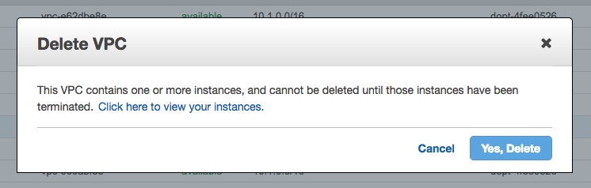

# Delete VPC

Easily delete a VPC and all it's dependencies.

No more of this...



or this..


or this..


# Usage

Basic usage:

```
$ delete-vpc delete vpc-6c1a3404
```

Pretty logs:

```
$ delete-vpc delete vpc-785f7d10 --log-level trace --log-to-stdout | bunyan
```

```
$ delete-vpc --help
delete-vpc [command]

Commands:
  delete-vpc delete [vpc-id]  Delete the VPC and all dependencies

Options:
  --help           Show help                                           [boolean]
  --version        Show version number                                 [boolean]
  --log-level      Log level (debug, trace, info, warn, error)[default: "error"]
  --log-to-stdout  Output logs to STDOUT instead of STDERR      [default: false]
```

```
$ delete-vpc delete --help
delete-vpc delete [vpc-id]

Delete the VPC and all dependencies

Positionals:
  vpc-id  ID of the VPC                                          [default: null]

Options:
  --help           Show help                                           [boolean]
  --version        Show version number                                 [boolean]
  --log-level      Log level (debug, trace, info, warn, error)[default: "error"]
  --log-to-stdout  Output logs to STDOUT instead of STDERR      [default: false]
```
